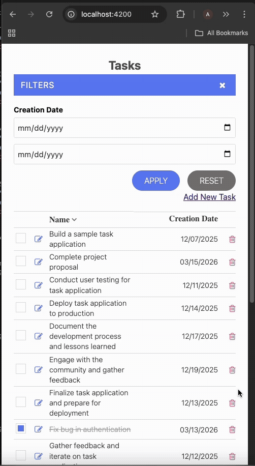

# Circut Ng

This is a web page that displays the list of tasks with an option to add and modify the task description in a sidebar, filter results by the creation date, and sort the results by description or creation date.

## Development Approach

Component-Based Architecture: Applications are built as a tree of self-contained components, each managing its own view (HTML template), logic (TypeScript class), and styles (CSS).

## Angular Features

1) Stand alone Components
2) Signal based Reactivity
3) Zoneless change detection
4) HttpClient for API call
5) NgRx Signal store for state management
6) angular-architects/ngrx-toolkit for sync to local/session for page refresh

## Technologies Used

```
Angular 21 - Frontend framework
TypeScript - Programming language
NgRx-SignalStore - State Management library
RxJS - Reactive programming library
NgRx-Toolkit - State persistence on page refresh (Session Storage/Local Storage)
Responsive Design

```
# Demo




# CricutNg

This project was generated using [Angular CLI](https://github.com/angular/angular-cli) version 21.0.4.

## Development server

To start a local development server, run:

```bash
ng serve
```

Once the server is running, open your browser and navigate to `http://localhost:4200/`. The application will automatically reload whenever you modify any of the source files.

## Code scaffolding

Angular CLI includes powerful code scaffolding tools. To generate a new component, run:

```bash
ng generate component component-name
```

For a complete list of available schematics (such as `components`, `directives`, or `pipes`), run:

```bash
ng generate --help
```

## Building

To build the project run:

```bash
ng build
```

This will compile your project and store the build artifacts in the `dist/` directory. By default, the production build optimizes your application for performance and speed.

## Running unit tests

To execute unit tests with the [Vitest](https://vitest.dev/) test runner, use the following command:

```bash
ng test
```

Angular CLI does not come with an end-to-end testing framework by default. You can choose one that suits your needs.

## Additional Resources

For more information on using the Angular CLI, including detailed command references, visit the [Angular CLI Overview and Command Reference](https://angular.dev/tools/cli) page.
